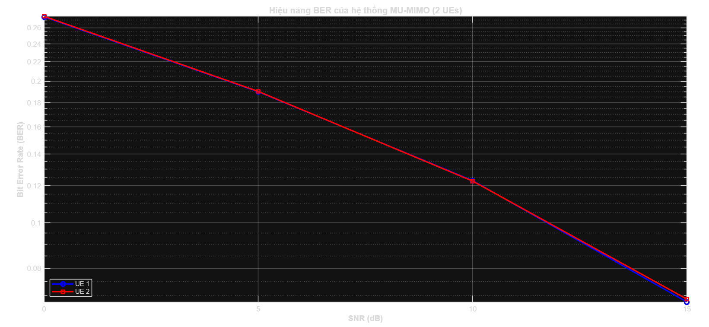
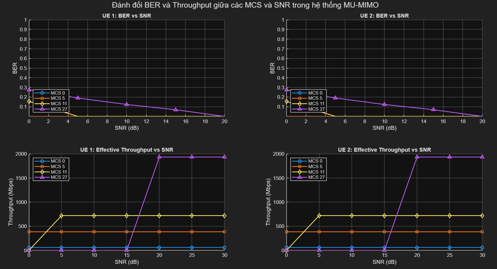
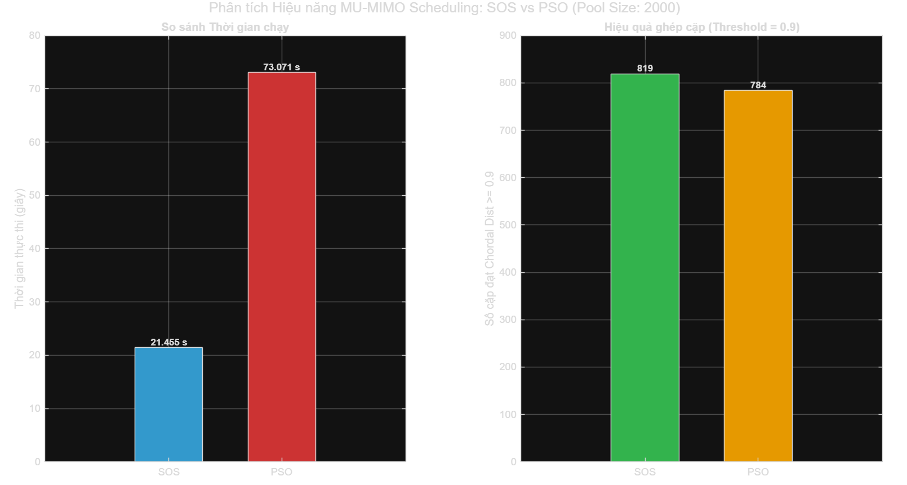

# MU-MIMO Scheduling using K-Means, SOS, and PSO

## Table of Contents
- [Introduction](#introduction)
- [System Model & Methodology](#system-model--methodology)
- [Key Features](#key-features)
- [Prerequisites](#prerequisites)
- [Code Architecture & Main Functions](#code-architecture--main-functions)
- [How to Run / Usage](#how-to-run--usage)

---

## Introduction
In the 5G New Radio (NR) era, **Multi-User MIMO (MU-MIMO)** is a fundamental 
technology for boosting spectral efficiency and system capacity by allowing multiple 
UEs to share the same time-frequency resources. However, mitigating 
**Inter-User Interference (IUI)** remains a critical challenge, requiring highly 
precise and efficient scheduling algorithms at the base station (gNB).

This project focuses on designing and simulating a **PDSCH** scheduler using a hybrid 
approach that combines two distinct algorithms:

1. **K-Means Clustering:** Groups UEs based on their spatial correlation derived from 
   Precoding Matrices (3GPP Type I CSI-RS Codebooks), narrowing down the search space 
   and identifying UEs with orthogonal spatial signatures.
2. **Symbiotic Organisms Search (SOS):** A meta-heuristic optimization algorithm 
   inspired by symbiotic interactions in nature. Applied to search through clustered 
   UEs to find the optimal user subset that maximizes **Sum-Rate** while maintaining 
   scheduling **Fairness**.

**Why this approach?**
Exhaustive search for the optimal MU-MIMO user pairing is computationally prohibitive 
in Massive MIMO setups (e.g., 32 antenna ports). By leveraging K-Means to pre-group 
users, we significantly reduce the search space for the SOS algorithm. This hybrid 
method delivers near-optimal throughput while keeping processing times realistic for 
5G environments.

---

## System Model & Methodology
The simulation follows the 5G NR downlink PDSCH transmission pipeline:

1. **CSI Feedback & Precoding Matrix:**
   - The gNB configures CSI-RS for multiple UEs.
   - UEs report CSI back using the **3GPP TS 38.214 Type I Codebook** (currently 
     supporting 32 ports).
   - The system reconstructs the Precoding Matrix Indicator (PMI) for each UE.

2. **User Grouping (K-Means):**
   - Precoding matrices are used as spatial feature vectors.
   - K-Means clusters UEs into groups based on spatial correlation, isolating UEs 
     with highly overlapping beams.

3. **MU-MIMO Scheduling (SOS / PSO):**
   - The optimization algorithm evaluates combinations of UEs from different K-Means 
     clusters to form the final MU-MIMO scheduling set.
   - The fitness function estimates PDSCH Sum-Rate and SINR based on spatial 
     signatures, minimizing IUI.

---

## Key Features

- **3GPP Compliant:** Parameters and channel models align with 5G NR specifications 
  (TS 38.211, TS 38.214).
- **Advanced CSI-RS Support:** Full handling of high-resolution Type I CSI reporting.
- **Scalable Antenna Configurations:** Supports 8-port, 16-port, and 32-port setups.
- **Hybrid Optimization:** Integrates K-Means clustering with SOS and PSO 
  meta-heuristic optimization for resource allocation.
- **Performance Visualizations:** Automated plotting of spatial distributions, 
  SOS convergence curves, and sum-rate comparisons against baseline schedulers.

---

## Prerequisites

- **MATLAB:** R2023a or newer recommended.
- **Required Toolboxes:**
  - 5G Toolbox
  - Communications Toolbox
  - Phased Array System Toolbox
  - Statistics and Machine Learning Toolbox (for K-Means)

---

## Code Architecture & Main Functions

### 1. Data Generation (CSI-RS & PMI)

- **`computePrecodingMatrix.m`**
  - **Purpose:** Generates PMI data for the UE pool.
  - **Description:** Simulates the gNB configuring CSI-RS and computes precoding 
    matrices for the defined number of antenna ports and transmission layers. Outputs 
    spatial data as `.mat` files into the `pmiData` folder.

### 2. Scheduling & Optimization

- **`sosMumimoScheduling.m`**
  - **Purpose:** Executes Symbiotic Organisms Search to find the optimal MU-MIMO 
    user pairing.
  - **Key Mechanism:**
    - **Smart Initialization:** Seeds the ecosystem using `cluster_idx` from K-Means, 
      forcing selection of UEs from different spatial clusters to reduce initial IUI.
    - **Evolutionary Phases:** Iterates through Mutualism, Commensalism, and 
      Parasitism phases to refine the selected UE subsets.
    - **Fast Fitness Function:** Uses a linear SINR approximation based on spatial 
      signatures (W^H W), avoiding full OFDM simulation during search iterations.
  - **Output:** Optimal UE indices, best achieved Sum-Rate, and convergence data.

- **`psoMUMIMOScheduling.m`**
  - **Purpose:** Executes Discrete Particle Swarm Optimization to find the optimal 
    MU-MIMO user grouping maximizing spatial separation.
  - **Key Mechanism:**
    - **Discrete Permutation Encoding:** Each particle is a permutation of UE indices 
      where consecutive blocks of `groupSize` elements define a group.
    - **Swap Sequence Velocity:** Velocity is represented as pairwise swaps, 
      reinterpreting the standard PSO update via `getSwapSequence` and 
      `multiplySwapSequence`.
    - **Chordal Distance Fitness:** Maximizes average chordal distance between UE 
      pairs within each group using a precomputed `distMat`.
    - **Adaptive Inertia & Early Stopping:** Inertia weight decays linearly from 0.9 
      to 0.4; early termination triggers after 15 consecutive iterations without 
      GBest improvement.
  - **Output:** `bestGroups` (cell array of UE index groups) and `bestScore` (best 
    average chordal distance).

- **`muMIMO2UE.m`**
  - **Purpose:** Full physical-layer MU-MIMO simulation for two simultaneous UEs, 
    from bit generation through OFDM modulation, channel emulation, and LDPC decoding.
  - **Key Mechanism:**
    - **Dual PDSCH Configuration:** Two `customPDSCHConfig` objects differentiated by 
      RNTI offset and non-overlapping DMRS port sets (`0:3` for UE1, `4:7` for UE2).
    - **Manual Multi-Port Resource Grid:** Builds layer grids manually for each UE, 
      applies precoding via `layerFlat * W.'`, and superimposes both users' port 
      signals before OFDM modulation.
    - **DMRS-Based Channel Estimation & MMSE Equalization:** Extracts received DMRS 
      pilots, computes least-squares channel estimates, and applies `nrEqualizeMMSE` 
      with calibrated noise variance from the input `SNR_dB`.
    - **Controlled Test Vectors:** UE1 transmits all-ones, UE2 transmits all-zeros, 
      making BER verification straightforward.
  - **Output:** `BER1` and `BER2` for UE1 and UE2 respectively.

- **`simulateRandomMUMIMOScheduling.m`**
  - **Purpose:** Top-level orchestration script connecting codebook loading, K-Means 
    clustering, PSO-based scheduling, and SNR-swept BER evaluation.
  - **Key Mechanism:**
    - **Data Preparation (`prepareData`):** Loads precoding matrices and draws 20,000 
      random UE samples to produce a synthetic UE population.
    - **Representative Pool via K-Means (`buildRepresentativePool`):** Runs K-Means 
      with cosine distance into up to 500 clusters, then draws a fixed quota per 
      cluster to form a `targetPoolSize = 2000` representative pool.
    - **PSO Orthogonal Group Search (`findFeasibleOrthogonalGroups`):** Invokes PSO 
      then post-validates each group by minimum pairwise chordal distance, retaining 
      only groups exceeding `threshold = 0.9999`.
    - **SNR-Swept BER Evaluation:** Passes the first feasible group's precoding 
      matrices to `muMIMO2UE` across `snrRange = 0:5:30` dB.
  - **Output:** Console table of per-UE BER at each SNR point and a BER waterfall 
    figure for the best scheduled UE pair.
  
* **`compareBerThroughput.m`**
  * **Purpose:** Head-to-head benchmarking script that runs both `sosMUMIMOScheduling` and `psoMUMIMOScheduling` on the same representative UE pool under identical conditions, then quantitatively compares execution time, average chordal distance score, and the number of valid orthogonal pairs produced by each algorithm.
  * **Key Mechanism:**
    * **Controlled Experimental Setup:** Both algorithms receive the exact same `W_pool` (built from an identical K-Means pipeline with `targetPoolSize = 2000`), `numberOfUeToGroup = 2`, `maxIter = 50`, and `threshold = 0.90`, eliminating all confounding variables so that measured differences are attributable solely to each algorithm's search strategy.
    * **Wall-Clock Timing via `tic`/`toc`:** Each algorithm call is individually bracketed by `tic`/`toc`, capturing total scheduling time including all internal initialization, fitness evaluations, and convergence logic — giving a fair end-to-end latency comparison representative of real deployment overhead.
    * **Post-Hoc Feasibility Counting (`countValidPairs`):** After each algorithm returns its groups, `countValidPairs` iterates over all returned groups and recomputes `chordalDistance` for each UE pair, counting only those that meet or exceed the orthogonality threshold. This decouples solution quality measurement from the optimizer's internal scoring, ensuring both algorithms are judged by the same external criterion.
    * **Tabular Console Summary:** Results are printed in an aligned three-column table covering execution time, average score, and valid pair count for SOS and PSO side-by-side, enabling immediate numerical comparison without inspecting figures.
    * **Two-Panel Bar Chart:** A figure with two subplots visualizes the comparison — execution time (lower is better, blue/red) and valid pair count at the given threshold (higher is better, green/orange) — with data labels rendered directly on each bar for readability.
  * **Output:** A formatted benchmark table in the console and a two-panel bar chart figure comparing SOS and PSO across runtime efficiency and orthogonal pairing quality.

---

## How to Run / Usage

### 1. Setup the Environment
Clone the repository:
```bash
git clone https://github.com/hoangdat12/csi-codebook.git
cd csi-codebook
```

### 2. Prepare Data
Navigate to the CSI-RS directory and generate PMI data:
```bash
cd csi-rs/typeI/single-panel
```

Open and run `computePrecodingMatrix.m` in MATLAB. Adjustable parameters:
```matlab
numberOfLayers = 4;
numberOfPorts  = 32;
folderName     = 'pmiData';
```

Copy the generated data to the scheduling directory:
```bash
cp -r pmiData ../../../mumimoScheduling
cd ../../../mumimoScheduling
```

### 3. Run the Simulations

#### A. Core Simulation
Run `simulateRandomMUMIMOScheduling` in the MATLAB command window.

##### Example Output:


The results show the scheduled UE pairs and their BER waterfall curves. Only UE pairs 
exceeding the chordal distance threshold (`0.9999`) are selected, ensuring minimal 
inter-user interference.

#### B. BER and Throughput Trade-off across MCS
Run `compareBerThroughput` in the MATLAB command window.

##### Example Output:


The results show BER and effective throughput per UE across MCS indices `[0, 5, 11, 27]` 
and SNR range `0–30 dB`. Higher MCS achieves greater peak throughput but degrades 
rapidly at low SNR, while lower MCS remains robust at the cost of reduced maximum 
throughput. Sum Rate is shown as the combined throughput of both UEs.

#### C. SOS vs PSO Execution Time Benchmark
Run `benchmark_sos_vs_pso` in the MATLAB command window.

##### Example Output:


The results compare execution time and valid orthogonal pair count between SOS and PSO 
under identical conditions, demonstrating the computational trade-off between the two 
scheduling approaches.